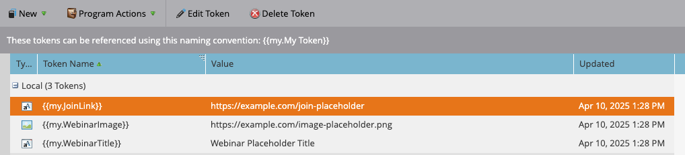

# Cómo almacenar en déclencheur una campaña inteligente en Marketo Engage mediante la API de REST y los tokens

Este tutorial le explica cómo almacenar en déclencheur una campaña inteligente en Marketo Engage mediante la API de REST y personalizar el correo electrónico con Mis tokens. Este caso de uso es ideal para notificaciones activadas por el cliente, como recordatorios de seminarios web, pasos de incorporación o seguimientos posteriores a la compra.

## Caso de uso {#use-case}

Una persona se registra para un seminario web a través de una plataforma externa (por ejemplo, aplicación personalizada, Pendo, Eventbrite). Desea hacer lo siguiente automáticamente:

* Déclencheur de un correo electrónico recordatorio desde Marketo Engage
* Personalícelo con:
   * El nombre de la persona
   * Título del seminario web
   * Un vínculo de unión único

Esto se puede hacer mediante la API de REST y Mis tokens.

## Paso 1: Creación de la campaña inteligente {#step-one}

1. Vaya a **Actividades de marketing** y en la carpeta [Programas](https://experienceleague.adobe.com/en/docs/marketo/using/product-docs/core-marketo-concepts/programs/creating-programs/understanding-programs){target="_blank"} cree una nueva [Campaña inteligente](https://experienceleague.adobe.com/en/docs/marketo/using/product-docs/core-marketo-concepts/smart-campaigns/understanding-smart-campaigns){target="_blank"} llamada `Send Webinar Reminder`.

1. En la ficha **Lista inteligente**, [agregue un déclencheur](https://experienceleague.adobe.com/en/docs/marketo/using/product-docs/core-marketo-concepts/smart-campaigns/creating-a-smart-campaign/define-smart-list-for-smart-campaign-trigger){target="_blank"} para permitir que se llame a la campaña a través de la API:

   * Seleccione **Se ha solicitado la campaña** como déclencheur
   * Definir **Source** en `Web Service API`


## Paso 2: Definir el contenido del correo electrónico {#step-two}

Cree o edite un [recurso de correo electrónico](https://experienceleague.adobe.com/en/docs/marketo-developer/marketo/rest/assets/emails){target="_blank"} que haga referencia a persona y a [Mis tokens](https://experienceleague.adobe.com/en/docs/marketo/using/product-docs/core-marketo-concepts/programs/tokens/managing-my-tokens){target="_blank"}.

>[!NOTE]
>
>Asegúrese de insertar los tokens directamente en el contenido del correo electrónico, como se muestra a continuación.

```html
Hi {{lead.First Name:default=Customer}}

You're registered for **{{my.WebinarTitle}}**.

Join here: {{my.JoinLink}}
```

Si utiliza un token para insertar dinámicamente una URL de imagen (por ejemplo, `{{my.WebinarImage}}`), debe envolver el token en una etiqueta de imagen de HTML:

```html

```

>[!IMPORTANT]
>
>Marketo Engage **no** procesará la imagen a menos que el token se coloque dentro de una etiqueta de imagen válida.


## Paso 3: Añadir tokens al programa {#step-three}

Para pasar valores de forma dinámica mediante API, los tokens deben existir ya en Marketo Engage. Deberá crearlos en la ficha **Mis tokens** de su programa.

1. Vaya a la pestaña **Mis tokens** de su programa principal.

2. Arrastre un **Token de texto** desde el panel derecho para cada valor dinámico.

* `{{my.WebinarTitle}}` - Token de texto
* `{{my.JoinLink}}` - Token de texto
* `{{my.WebinarImage}}` - Token de texto (se usará como `src` en una etiqueta ``)



## Paso 4: Establecer las reglas de calificación de campaña y activar la campaña {#step-four}

1. Configure las [reglas de calificación](https://experienceleague.adobe.com/en/docs/marketo/using/product-docs/core-marketo-concepts/smart-campaigns/using-smart-campaigns/edit-qualification-rules-in-a-smart-campaign){target="_blank"} para controlar la frecuencia con la que una persona puede ejecutar la campaña inteligente.

1. Una vez configurada, haga clic en **Activar** para permitir que Smart Campaign reciba solicitudes activadas por API.


## Paso 5: Almacenar en Déclencheur la campaña a través de la API de REST {#step-five}

### Búsqueda del ID de campaña {#find-the-campaign-id}

Para almacenar en déclencheur una campaña inteligente a través de la API, necesitas la **ID de campaña**:

1. Busque y seleccione la campaña inteligente en la que desee almacenar el déclencheur.

1. Observe la dirección URL en el explorador. Se verá algo así: `https://app-XXX.marketo.com/#/classic/SC`**1234**`A1ZN38`.

1. Los 4 dígitos después de `SC` son su ID de campaña; en el ejemplo anterior, el ID de campaña inteligente es &quot;1234&quot;

Utilice el siguiente punto final:

```
POST /rest/v1/campaigns/{campaignId}/trigger.json
```

Por ejemplo:

```
POST /rest/v1/campaigns/1234/trigger.json
```

### Cuerpo de solicitud de ejemplo {#example-request-body}

```json
{
  "input": {
    "leads": [
      {
        "id": 1002200
      }
    ],
    "tokens": [
      {
        "name": "{{my.WebinarTitle}}",
        "value": "Scaling Customer Engagement in 2025"
      },
      {
        "name": "{{my.JoinLink}}",
        "value": "https://webinars.company.com/join/abc123"
      },
      {
        "name": "{{my.WebinarImage}}",
        "value": "https://experienceleague.adobe.com/en/docs/marketo-learn/tutorials/events/media_1c6f338a518ada11550084c8ab3a6bbf554ff6eac.jpeg"
      }
    ]
  }
}
```

>[!IMPORTANT]
>
>Reemplace `1002200` en el ejemplo de cuerpo anterior por el ID de persona correcto de su instancia de Marketo Engage.

## Autorización {#authorization}

Todas las solicitudes de API de REST de Marketo requieren un token de acceso de OAuth 2.0.

Para recuperar el token de acceso, utilice el siguiente punto de conexión:

```
GET /identity/oauth/token?grant_type=client_credentials&client_id=XXX&client_secret=YYY
```

Una vez que reciba el token de acceso, inclúyalo como _parámetro de consulta_ en todas las solicitudes de API:

```
Authorization: Bearer YOUR_ACCESS_TOKEN
```

## Mejores prácticas {#best-practices}

* Añadir valores de reserva/predeterminados a los tokens para pruebas y control de calidad
* Utilice `{{lead.token}}` para los campos de persona y `{{my.token}}` para los valores dinámicos con alcance de campaña
* Marketo Engage admite hasta 100 personas por solicitud
* Las personas deben cumplir los criterios de la lista inteligente; de lo contrario, se omiten silenciosamente

## Resumen {#summary}

Con este enfoque, puede personalizar las comunicaciones mediante campañas inteligentes activadas desde plataformas externas a través de API. Esto resulta útil para escenarios como confirmaciones de registro de seminarios web, correos electrónicos de incorporación y notificaciones transaccionales, todo mientras se inyectan datos en tiempo real mediante Mis tokens.
