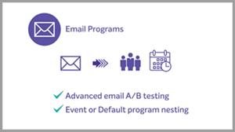

# Tutoriales de [!DNL Marketo Engage]

Examine nuestra biblioteca de tutoriales y aproveche al máximo [!DNL Marketo Engage]. Estos tutoriales pueden ayudar a complementar la [[!DNL Marketo] documentación del producto](https://experienceleague.adobe.com/docs/marketo/using/home.html?lang=es){target="_blank"} para ayudarle a comprender mejor las características de automatización de marketing.

<!-- 

 
-->

## Novedades {#whats-new}

* [Asistente de IA para correo electrónico en Designer](https://experienceleague.adobe.com/en/docs/marketo-learn/tutorials/shorts/ai-assistant-email-designer)
  _Use el Asistente para IA en Marketo Engage Email Designer para crear correos electrónicos contemporáneos, eficaces e intuitivos._

* [Contenido condicional](https://experienceleague.adobe.com/en/docs/marketo-learn/tutorials/shorts/conditional-content)
  _Aprenda a controlar dinámicamente qué contenido ve cada audiencia._

* [Prácticas recomendadas para implementar el chat en vivo](https://experienceleague.adobe.com/es/docs/marketo-learn/tutorials/dynamic-chat/live-chat-best-practices)
  _Conozca las prácticas recomendadas que debe seguir al implementar la función de chat en directo en Dynamic Chat._

## Vídeos más populares {#most-popular-videos}

<table>
<tr>
<td>

<a href="https://experienceleague.adobe.com/es/docs/marketo-learn/tutorials/programs-and-campaigns/smart-campaigns-101"><strong>Campañas inteligentes 101</strong></a>

</td>
<td>

<a href="https://experienceleague.adobe.com/es/docs/marketo-learn/tutorials/dynamic-chat/conversational-forms"><strong>Formularios de conversación</strong></a>

</td>
<td>

<a href="https://experienceleague.adobe.com/es/docs/marketo-learn/tutorials/fundamentals/programs-and-campaigns"><strong>Explicación de los programas y campañas de Marketo</strong></a>

</td>
</tr>
</table>
