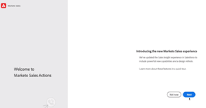

# Tutoriales de acciones de Insight de ventas

Use [!UICONTROL Acciones de Insight de ventas] para acelerar los esfuerzos de prospección con herramientas de participación e inteligencia de marketing en un solo flujo de trabajo.

>[!NOTE]
>
>Marketo Sales Insight Actions es una aplicación basada en la Web que se integra exclusivamente con Salesforce CRM mediante el [paquete Marketo Sales Insight](https://experienceleague.adobe.com/es/docs/marketo/using/product-docs/marketo-sales-insight/msi-for-salesforce/installation/install-marketo-sales-insight-package-in-salesforce-appexchange){target="_blank"}. A veces se denomina &quot;Ventas Marketo&quot; o simplemente &quot;Acciones&quot;.

## Tutoriales destacados {#featured-tutorials}

<table style="table-layout:fixed">
<tr>
<td>

<a href="/help/main/sales-insight-actions/sales-insight-actions-overview.md"><strong>Resumen de acciones de ventas en Insight</strong></a>

</td>
<td>

<a href="/help/main/sales-insight-actions/accessing-your-sales-insight-actions-instance.md"><strong>Acceder A Su Instancia De Acciones De Insight De Ventas</strong></a>

</td>
<td>

<a href="/help/main/sales-insight-actions/configure-sales-activity-logging-to-salesforce.md"><strong>Configurar el registro de actividades de ventas en [!DNL Salesforce]</strong></a>

</td>
</tr>
</table>

## Artículos destacados {#featured-articles}

<table style="table-layout:fixed">
<tr>
<td>

<a href="https://experienceleague.adobe.com/docs/marketo/using/product-docs/marketo-sales-insight/actions/sales-insight-actions-feature-overview.html?lang=es"><strong>Información general sobre la función de acciones de ventas de Insight</strong></a>

<em>Acelere los esfuerzos de prospección con herramientas de participación e inteligencia impulsadas por el marketing.</em>

</td>
<td>

<a href="https://experienceleague.adobe.com/docs/marketo/using/product-docs/marketo-sales-insight/actions/getting-started/sales-insight-actions-user-onboarding-checklist.html?lang=es"><strong>[!DNL Sales Insight Actions] Guía de incorporación de usuario</strong></a>

<em>Pasos que los nuevos usuarios deberán seguir para comenzar.</em>

</td>
<td>

<a href="https://experienceleague.adobe.com/docs/marketo/using/product-docs/marketo-sales-insight/actions/admin/actions-data-sync-faq.html?lang=es"><strong>Preguntas frecuentes sobre la sincronización de datos de acciones</strong></a>

<em>Preguntas frecuentes relacionadas con el funcionamiento de la sincronización de unificación de datos.</em>

</td>
</tr>
</table>
